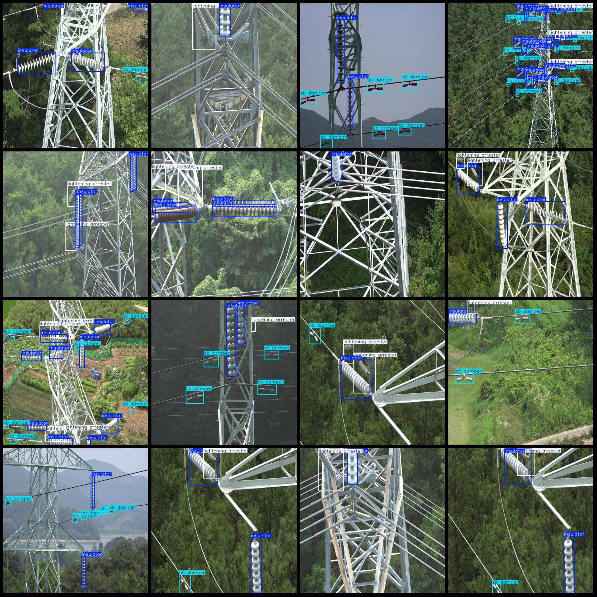
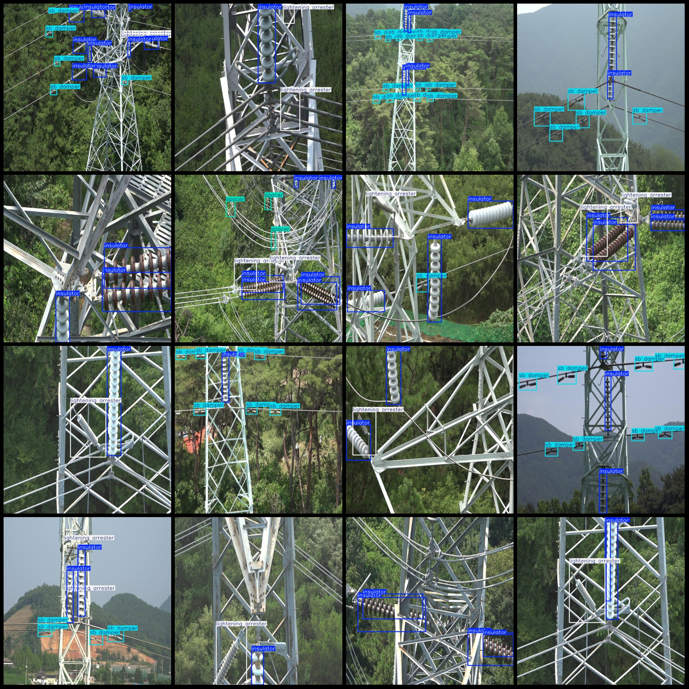

# Power Transmission Line Components Insulator, Shock Absorber, Junction Post, Lightning Shield Test Data Set in VOC+YOLO Format with 1206 Images in 5 Categories

Please note that this detection does not include any defects.
Dataset format: Pascal VOC format + YOLO format (without split path's txtfile, only contain jpgimage and corresponding VOC format xmlfile and yolo format txtfile)
number of images: 1206  
annotation count: 1206  
annotation count: 1206  
annotationnumber of classes: 5  
Annotation class names: ["insulator", "lightening arrester", "sb damper", "spacer", "tower"]
boxes per class:   
insulator box count = 3990
lightening arrester box count = 1080
sb damper box count = 2489
spacer box count = 127
tower box count = 5
total boxes: 7691  
image resolution: 640x640  
Use the annotation tool: labelImg
Rules for labeling: Draw a rectangle around the category.
Important Notes: There is no content available.
Special Notice: This dataset does not guarantee the accuracy of the trained model or the weight file.
Image preview:
Annotation example:
## Images

Here is a pay link on Stripe ( https://buy.stripe.com/3cs8yP7sY87d0vu9AB ). Please contact me lonlonago@foxmail.com after funding $89, and I will send you a complete data files , thank you!

